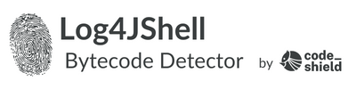

# 🔍 Log4JShell Bytecode Detector

Log4jShell Bytecode Detector is an open source tool that helps identify if a jar file is affected by the critical CVE-2021-44228. The tool scans the jar file and compares the classses against a set of vulnerable hashes for classes within the jar file. The hashes have been pre-computed for artifacts on [Maven Central](https://mvnrepository.com/repos/central).

**IMPORTANT UPDATE: We extended [the list of affected artifacts](src/main/resources/VulnerableGavs.csv) on Maven Central. The list contains 18.816 artifacts. The artifacts either use log4j-core as declared dependency, or we identified .class files within the artifacts that match to the affected versions of log4j-core.**

## 📝 How to run

1. Download the [jar file](https://github.com/CodeShield-Security/Log4JShell-Bytecode-Detector/releases/download/v0.6.3/Log4JDetector-0.6.3-jar-with-dependencies.jar) under releases. 
2. Run `java -cp <PATH_TO_DOWNLOADED_JAR> de.codeshield.log4jshell.Log4JDetector <ABSOLUTE_PATH_TO_JAR_TO_CHECK>`


If the jar is affected, the tool outputs information to the command-line:

```
CVE-2021-44228 found declared as dependency in META-INF/maven/org.apache.logging.log4j/log4j-core/pom.xml
CVE-2021-44228 found in class file org/apache/logging/log4j/core/net/JndiManager$1.class
```

## 📝 How to run on a live server (no need to stop your running Java instances)

1. Download the [jar file](https://github.com/CodeShield-Security/Log4JShell-Bytecode-Detector/releases/download/v0.6.3/Log4JDetector-0.6.3-jar-with-dependencies.jar) under releases.
2. Run `java -cp <PATH_TO_DOWNLOADED_JAR> de.codeshield.log4jshell.Log4JProcessDetector`
3. The jar searches the classpath of all running java processes for vulnerable log4j instances


## ❓ Background on CVE-2021-44228

A serious Remote Code Execution vulnerability has been discovered within log4j and version 2.0-beta9 to 2.14 are affected. The vulnerability has been classified as critical, as it affected log4j one of the most used logging libraries for Java. There are many references and article out there.

* [Hackernews](https://thehackernews.com/2021/12/extremely-critical-log4j-vulnerability.html)
* [BSI (german only)](https://www.bsi.bund.de/SharedDocs/Cybersicherheitswarnungen/DE/2021/2021-549032-10F2.pdf?__blob=publicationFile&v=6)
* [Proof of Concept for exploiting the vulnerability](https://github.com/0x0021h/apache-log4j-rce)
* [Log4JShell Cheat Sheet](https://www.techsolvency.com/story-so-far/cve-2021-44228-log4j-log4shell/)

##  👀 Why is it important?

Log4j is and has been used in mostly any Java project for logging purposes. Now we need to understand which projects and libraries are actually affected. As of Java's dependency mechanism, an application can also be affected if it `transitively` includes the vulnerable library version. A project `A` includes a library `lib` `transitively`, if one of the direct dependecy `B` of `A` has a dependecy to `lib`. A simple test to see if one is affected can be done using using the maven dependecy tree:

Example: Execute command `mvn dependency:tree` on a maven project. 

```
[INFO] exampleProject:mainProject:jar:0.0.1-SNAPSHOT
[INFO] +- exampleProject:lib-using-log4j:jar:0.0.1-SNAPSHOT:compile
[INFO] |  \- org.apache.logging.log4j:log4j-core:jar:2.14.1:compile
```

This check, however, is only a first indication and does not suffice due to the following reasons: 

Java programs are frequently:
* packaged as fatjar or uberjar: All class files (including direct and transitive dependencies) are shipped into a single jar file. (as we do for this software artifact) 
* re-packaged or rebundled: the originaly package names are changed to avoid naming conflicts (some compilers and package mechanism apply code transformations)
* re-compiled: The source code is compiled with a different compiler and packaged as new, which leads to modified bytecode

Consequently, _*any*_ library a Java project is using can include the vulnerability into your project. An in-depth bytecode analysis helps, which is what we publish as part of this repository. 

## 📕 The script
1. Extract pom.xml files from .jar 
2. check declared dependencies against a [pre-computed list](src/main/resources/VulnerableGavs.csv) of affected groupId:artifactId:version list for artifacts hosten on Maven Central
3. Extract .class files from .jar
4. Compute SHA hashes of the class file
5. Match SHAs against a [pre-computed list](src/main/resources/VulnerableClassSHAs.csv)

## 🛠 Build Instructions

To build this tool run 

`mvn compile`

For assembling a runnable `jar` use

`mvn clean compile assembly:single`

## 💡 Precomputed Hashes of Vulnerable Classes

The set of vulnerable hashes for classes has been pre-computed on entire [Maven Central](https://mvnrepository.com/repos/central) repository. The hashes of the classes contain all hashes that we identified as bytecode-similar using the Fingerprinting technology.

The pre-computed information contains:

* all artifacts that directly include log4j in any of the vulnerable version
* all artifacts that ship a class that contains a vulnerable hash of log4j in the affected version range
* all artifacts that rebundle a vulnerable class of log4j 
* all artifacts that have a re-compiled class of a class of log4j in the affected version range

As affected version range we considered [2.0-beta9, 2.15) [Reference](https://logging.apache.org/log4j/2.x/security.html).

## 💻 Fingerprinting Technology
This tool uses a new bytecode fingerprinting technology for Java that has been invented by Andreas Dann. The basic flow is as follows. 
1. Use the available fix commits [Commit1](https://gitbox.apache.org/repos/asf?p=logging-log4j2.git;h=7fe72d6), [Commit2](https://gitbox.apache.org/repos/asf?p=logging-log4j2.git;h=d82b47c), and [Commit3](https://gitbox.apache.org/repos/asf?p=logging-log4j2.git;h=c77b3cb) to identify which classes are affected.
2. Compute bytecode "Fingerprints" of vulnerable classes.
3. Search for other classes on MavenCentral with same "Fingerprint".

*Note: For a simpler roll out, this repository does ship SHA hashes of the vulnerable classes, the information has been computed using Fingerprinting*

## 📌 Disclaimer

The list of hashes and maven artifacts is not complete. We will regularly update the lists.

## 📯 Contributors

This tool was co-created by the CodeShield co-founders

* Andreas Dann <andreas.dann@codeshield.io>
* Johannes Spaeth  <johannes.spaeth@codeshield.io> 

Feedback is welcome!

We are working on extending on the the list of affected artifacts and are always looking to improve our offering. `contribution welcome`

Also, ⭐️ this repository if our scanner helped you!

## ✍️ Contact

If you need support, or want to hear about our technology contact us at info@codeshield.io.

Your CodeShield Team 💚

